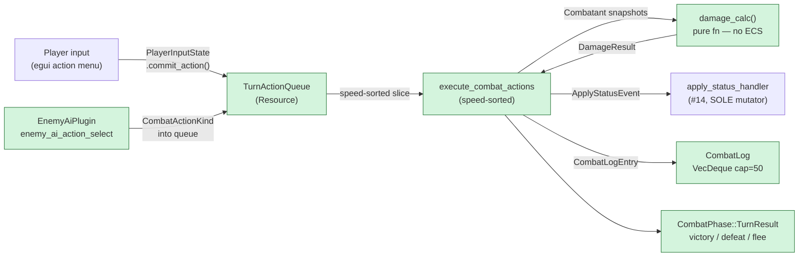

## TL;DR

Adds the action-queue turn-based combat loop (Feature #15): `PlayerInput` → enemy AI fills queue → speed-sorted `ExecuteActions` → `TurnResult`. This is the largest single feature in the roadmap (4/5 difficulty) and the main gameplay loop; it unblocks #16 (Encounter System) and #17 (Combat Polish).

## Why now

Feature #14 shipped `ApplyStatusEvent` / `apply_status_handler` / `is_paralyzed` / `is_asleep` / `is_silenced` predicates — the exact contracts #15 consumes. Feature #11 provided `DerivedStats`/`StatusEffects`; #12 provided `Equipment`/`EquipmentChangedEvent`; #13 established the `.before(apply_status_handler)` cross-plugin scheduling precedent. All four dependencies are merged. The roadmap at line 824 flagged this as the feature to plan as multiple sub-phases; this PR delivers all four (15A turn manager → 15B damage → 15C AI → 15D UI) as a single branch.

Plan: `project/plans/20260508-100000-feature-15-turn-based-combat-core.md`
Research: `project/research/20260508-093000-feature-15-turn-based-combat-core.md`
Implementation deviations (D-I1–D-I20): `project/implemented/20260508-120000-feature-15-turn-based-combat-core.md`
Code review (0 CRITICAL/HIGH, 2 MEDIUM resolved, 2 LOW deferred): `project/reviews/20260508-140000-feature-15-turn-based-combat-core.md`

## How it works

`CombatPlugin` registers three new sub-plugins. `TurnManagerPlugin` drives the state machine and action queue. `EnemyAiPlugin` fills enemy slots into that queue without touching ECS state directly. `CombatUiPlugin` paints the egui overlay and commits player actions to `PlayerInputState`. Damage is a pure function; status side-effects flow through the existing `ApplyStatusEvent` pipeline from #14.



## Reviewer guide

Start at `src/plugins/combat/turn_manager.rs` lines 69–240 — that is the `TurnActionQueue` resource definition, the `execute_combat_actions` system, and the `CombatantSnapshot` pre-collection pattern that resolves the Bevy B0002 query conflict (D-I1). The speed-sort + mid-turn death handling lives there.

After that, read `src/plugins/combat/damage.rs` lines 1–130 — the pure `damage_calc` function (Wizardry-style formula, variance multiplier, crit). It takes no queries, no resources; the eight unit tests cover all edge cases.

`src/plugins/combat/ai.rs` lines 64–145 — the `EnemyAiQuery` type alias (`&'static mut EnemyAi` for boss counter mutation, D-I19) and the `enemy_ai_action_select` system. Confirm it never writes `ApplyStatusEvent`, never reads `current_hp` with `=` operator.

`src/plugins/combat/ui_combat.rs` lines 1–60 — `CombatUiPlugin` wiring; the `handle_combat_input` function at ~line 220 is the only UI→state bridge.

Skim `src/plugins/combat/mod.rs` for sub-plugin registrations and `src/plugins/party/inventory.rs` lines ~440–450 for the D-A5 `With<PartyMember>` filter removal.

Pay attention to:
- `execute_combat_actions.before(apply_status_handler)` scheduling — if this regressed, Defend's `DefenseUp` would be applied after the turn resolves.
- `BossAttackDefendAttack { turn }` mutation in `ai.rs` — the `&'static mut EnemyAi` type alias is the key; without it the turn counter never increments.
- The `UseItem` key-item rejection path in `execute_combat_actions` — it fires before inventory access, so the test needs no `Inventory` component.

## Scope / out-of-scope

**In scope:**
- 8 new files under `src/plugins/combat/`: `actions.rs`, `ai.rs`, `combat_log.rs`, `damage.rs`, `enemy.rs`, `targeting.rs`, `turn_manager.rs`, `ui_combat.rs`
- `TurnManagerPlugin`, `EnemyAiPlugin`, `CombatUiPlugin` sub-plugins registered from `CombatPlugin::build`
- Pure `damage_calc` — Wizardry multiplicative formula, variance `0.7..=1.0`, crit 1.5x
- Defend → `DefenseUp 0.5` via existing `ApplyStatusEvent` pipeline; take-higher rule preserved
- `BossAi` enum with 3 variants (`RandomAttack`, `BossFocusWeakest`, `BossAttackDefendAttack { turn }`) for #17
- `rand 0.9` direct dep + `rand_chacha 0.9` dev-dep (both were already transitive; now explicit)
- D-A5 carve-out: `With<PartyMember>` filter dropped from `recompute_derived_stats_on_equipment_change`
- 191 passing tests (default) / 194 (dev)

**Out of scope (deferred):**
- `CastSpell` body — deferred to #20 (Spell System); current arm is a stub that logs "not yet implemented"
- Production `CurrentEncounter` population — deferred to #16 (Encounter System); dev-feature stub spawner in place
- Full boss authoring — deferred to #17 (Combat Polish); `BossAi` enum hook is the contract
- Silence-blocks-spell-menu log emission — deferred (UX polish); menu state correctly blocks entry, no log entry emitted
- LOW-1: two AI tests are pass-if-no-panic vacuous (`random_attack_picks_alive_party_member`, `random_attack_skips_dead_enemies`) — accepted per user authorization
- LOW-2: `check_victory_defeat_flee` `party.iter().all(...)` vacuously true on empty query — not reachable via #16's encounter spawner; accepted per user authorization

## Risk and rollback

The D-A5 carve-out (dropping `With<PartyMember>` from `recompute_derived_stats_on_equipment_change`) is the highest-risk change to a pre-existing system: enemies now re-derive stats on any `EquipmentChangedEvent`. The event carries an `EquipSlot::None` sentinel for status-only triggers — the filter removal is architecturally correct and tested by `enemy_buff_re_derives_stats`, but it is a behavioral change to a #12 system.

`BossAttackDefendAttack { turn }` mutation requires `&'static mut EnemyAi` in the query alias — any future code that adds a second writer of `EnemyAi` will need to route through the same system or split the query.

`CastSpell` stub emits a log entry and returns early; it does not crash. Rollback for this entire PR: revert the feature branch commit — no schema or asset migration needed.

## Future dependencies (from roadmap)

- **Feature #16 (Encounter System)** — replaces the dev-stub `spawn_test_encounter` path with `start_combat(enemy_group)` populated from floor encounter tables. Consumes `CurrentEncounter: Resource` and `Enemy`/`EnemyBundle` defined here.
- **Feature #17 (Combat Polish + Boss Authoring)** — extends the `BossAi` enum with authored patterns beyond the two stub variants. Consumes `EnemyAiPlugin`'s dispatch loop and the `BossAttackDefendAttack { turn }` counter-increment pattern established here.
- **Feature #20 (Spell System)** — fills the `CombatActionKind::CastSpell` stub body. Consumes the `TurnActionQueue` queue-entry shape and the `execute_combat_actions` arm that currently early-returns.

## Test plan

- [x] `cargo test` — 191 passed, 0 failed (default features)
- [x] `cargo test --features dev` — 194 passed, 0 failed
- [x] `cargo clippy --all-targets -- -D warnings` — PASS (zero warnings)
- [x] `cargo clippy --all-targets --features dev -- -D warnings` — PASS
- [x] `cargo fmt --check` — PASS (exit 0)
- [x] `cargo test damage` — damage formula edge cases: defense > attack clamps to 0, crit applies 1.5x, variance within `0.7..=1.0`
- [x] `cargo test speed` — turn ordering: speed-descending sort, lower-slot tiebreak deterministic
- [x] `cargo test mid_turn` — action queue execution with mid-turn deaths (target re-resolution via `resolve_target_with_fallback`)
- [x] `cargo test boss_attack_defend_attack` — `BossAttackDefendAttack` emits Attack/Defend/Attack over 3 turns AND `turn` counter reaches 3 (MEDIUM-2 regression guard)
- [x] `cargo test defend_no_ops_when_higher_defense_up_active` — take-higher rule: `DefenseUp 0.5` no-ops when `DefenseUp 1.0` already present (MEDIUM-1)
- [x] `cargo test use_item_rejects_key_items` — `UseItem` with a `KeyItem` asset logs "cannot use" before inventory access (MEDIUM-1)
- [x] `cargo test silence_blocks_spell_menu` — silenced party member in slot 0 cannot navigate to `SpellMenu` (MEDIUM-1)
- [x] `cargo test enemy_buff_re_derives_stats` — enemy with `DefenseUp 0.5` re-derives `DerivedStats.defense > 0` after `EquipmentChangedEvent` (MEDIUM-1 + D-A5 smoke test)

### Manual UI smoke test

Reviewers should also exercise the combat UI manually — the cargo gate above doesn't cover render/input paths.

```
cargo run --features dev
```

Press **F9** to cycle `GameState`s: `Loading → TitleScreen → Town → Dungeon → Combat`. On entering `Combat`, the dev-only `spawn_dev_encounter` (turn_manager.rs:647) auto-spawns 2 Goblins (hp=30, attack=8, defense=5, speed=6).

What to look for:

- [ ] **Persistent action panel** at the bottom (~60px) — D-Q2=A
- [ ] **Combat overlay on dungeon camera** (no scene swap) — D-Q1=A
- [ ] **Combat log** shows `--- Combat begins ---`; ring buffer cap=50 kept across combats — D-Q3=A
- [ ] **Action menu navigation**: Attack / Defend / Spell / Item / Flee
- [ ] **Target selection sub-menu** opens when selecting Attack
- [ ] **Defend** writes `DefenseUp` via `ApplyStatusEvent` (visible next-turn defense buff) — D-Q4=A take-higher
- [ ] **Speed-sorted execution**: party (varies) vs Goblin (speed=6) — D-A3=A Wizardry multiplicative damage in log
- [ ] **Spell menu is a stub** (CastSpell deferred to #20) — selecting a spell logs but doesn't resolve
- [ ] **No animations / camera shake** — that's #17

To exercise MEDIUM-2's boss-cycle fix visually, swap one Goblin's `ai` field at `turn_manager.rs:682` to `EnemyAi::BossAttackDefendAttack { turn: 0 }` and watch the action sequence cycle Attack → Defend → Attack across 3 turns.

🤖 Generated with [Claude Code](https://claude.com/claude-code)
