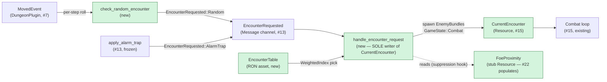

## TL;DR

Adds the encounter detection layer that bridges dungeon exploration to combat (Feature #16): per-cell encounter rate + per-step soft-pity accumulator rolls against per-floor weighted enemy tables; on a hit, `handle_encounter_request` spawns enemies, populates `CurrentEncounter`, and transitions `Dungeon → Combat`. The system composes with #13's existing alarm-trap pipeline and hands off directly to #15's combat loop.

## Why now

Feature #15 shipped `CurrentEncounter`, `EnemyBundle`, `CombatRng`, and the `start_combat` entry point — the exact contracts #16 consumes. Feature #13 established `EncounterRequested: Message` / `apply_alarm_trap` as the message-pipe precedent #16 follows for its random-roll producer. Feature #3 provided `RonAssetPlugin` and the `DungeonAssets` struct that #16 extends with an `encounters_floor_01` handle. All prior dependencies are merged.

Plan: `project/plans/20260508-200000-feature-16-encounter-system-and-random-battles.md`
Implementation summary + recovery deviations: `project/implemented/20260508-235900-feature-16-recovery-verify-and-commit.md`

## Updates after first review

Three follow-up commits (`3216011`, `0e846ac`) addressed first-pass review findings and a playtest bug:

- **`3216011 test(combat): address review MEDIUM findings`** — wired `DungeonAssets` into `rate_zero_cell_no_encounter_rolls` and `foe_proximity_suppresses_rolls` (they previously passed via the asset-missing early-return, not the real guards), and added 4 new tests: `handle_encounter_request_sole_writer` (grep guard), `no_current_encounter_after_combat_exit` (`OnExit(Combat)` cleanup), `encounter_rate_clamp` (cell-rate trust-boundary clamp), `max_enemies_per_encounter_truncation` (8-enemy cap).
- **`0e846ac fix(content): author encounter_rate on floor_01 walkable cells`** — playtest surfaced 54 steps with zero encounters. Root cause: `CellFeatures::encounter_rate` defaults to `0.0` and `floor_01.dungeon.ron` never authored a value on any cell, so the probability formula evaluated to 0.0 every step. Authored `encounter_rate: 0.05` on the 24 walkable cells (rows y=1..=4) per the smoke-test target. Added `floor_01_has_authored_encounter_rates` regression guard that loads the production asset and asserts >= 4 cells have non-zero rates.

Test count: 205 default / 209 dev (original) → **210 default / 214 dev** (post-fixes). Floor 2 has the same data gap; left for a follow-on once #17 makes it reachable in playtest.

## How it works

`check_random_encounter` reads `MovedEvent`, computes the soft-pity-scaled probability (`cell.encounter_rate * (1.0 + steps_since_last as f32 * 0.05).min(2.0)`), and on a roll hit writes `EncounterRequested { source: Random }` to the shared message channel. `handle_encounter_request` is the SOLE consumer: it picks an `EnemyGroup` via `WeightedIndex` from the floor's `EncounterTable`, spawns `EnemyBundle`s, inserts `CurrentEncounter`, and pushes `GameState::Combat`. Alarm traps from #13 write to the same channel — one consumer seam, two producers. `snap_movement_animation_on_combat_entry` fires on `OnEnter(Combat)` to kill any in-flight movement tween.



## Reviewer guide

Start at `src/plugins/combat/encounter.rs` (~775 LOC, the new plugin). The load-bearing invariant is the SOLE-writer guarantee on `CurrentEncounter`: `handle_encounter_request` is the only production site that inserts it. Verify by grepping `insert_resource(CurrentEncounter` across `src/**/*.rs` excluding `encounter.rs` and test modules — must return zero matches.

After that, read `src/data/encounters.rs` (~210 LOC, the schema). Focus on the trust-boundary clamps: `encounter_rate.clamp(0.0, 1.0)` in `check_random_encounter`, `weight.clamp(1, 10_000)` in `pick_group`, and the `MAX_ENEMIES_PER_ENCOUNTER = 8` truncation in `handle_encounter_request`. These defend against RON typos and asset poisoning.

Then check `src/plugins/combat/turn_manager.rs` for the DELETED `spawn_dev_encounter` dev stub. The plan flagged this as Pitfall 8: the stub and `EncounterPlugin` would double-spawn enemies under `feature = "dev"`. Confirm the deletion by grepping the diff for `spawn_dev_encounter` — it must not appear in the post-merge source.

The remaining touched files are cascade fixes only (no new behavior):
- `src/plugins/dungeon/{features,tests}.rs` — `EncounterSource::Random` appended to the existing enum; `DungeonAssets` test fixture extended with `encounters_floor_01: Handle::default()` and `init_asset::<EncounterTable>()`.
- `src/plugins/combat/{ui_combat}.rs` — `init_asset::<EncounterTable>()` + `add_message::<EncounterRequested>()` added to the test-app builder.
- `src/plugins/ui/minimap.rs` — one-line cascade fix (no behavior change).
- `tests/dungeon_{geometry,movement}.rs` — same `DungeonAssets` fixture extension pattern.
- `src/plugins/loading/mod.rs` — `RonAssetPlugin::<EncounterTable>` added inside the existing plugin tuple (ordering preserved per the brittle `add_loading_state` constraint); `encounter_table_for` helper added.

Pay attention to:
- `check_random_encounter.after(handle_dungeon_input)` and `handle_encounter_request.after(check_random_encounter)` scheduling — matches `apply_alarm_trap` shape; if either is dropped, encounter rolls will either miss events or fire in the wrong order.
- The soft-pity reset on `OnEnter(Dungeon)` — covers both combat-return and cross-floor teleport; accumulator must not persist into the new floor.
- The `rate_zero_cell_no_encounter_rolls` test — verifies the 2.0× cap doesn't cause bogus rolls on rate-zero corridor cells.

## Scope / out-of-scope

**In scope:**
- 2 new source files: `src/plugins/combat/encounter.rs` (~775 LOC) and `src/data/encounters.rs` (~210 LOC)
- 1 new RON asset: `assets/encounters/floor_01.encounters.ron` (4 enemy groups, weights sum to 100)
- `EncounterPlugin` sub-plugin registered inside `CombatPlugin::build` (mirrors `TurnManagerPlugin` precedent)
- Per-cell encounter rate + per-step soft-pity accumulator, cap 2.0× (D-X2)
- `handle_encounter_request` as SOLE writer of `CurrentEncounter`
- `FoeProximity: Resource` stub — populated by #22; currently always empty (suppression hook wired, never fires)
- `snap_movement_animation_on_combat_entry` — kills in-flight tween on `OnEnter(Combat)` (D-A9)
- `EncounterSource::Random` variant appended to existing enum in `dungeon/features.rs`
- `SfxKind::EncounterSting` emitted from `handle_encounter_request` (matches `apply_alarm_trap` precedent)
- `?force_encounter` F7 dev command (direct `ButtonInput<KeyCode>`, `#[cfg(feature = "dev")]` only — `input/mod.rs` frozen)
- Trust-boundary clamps on all RON-deserialized values
- Deletion of `spawn_dev_encounter` dev stub from `turn_manager.rs` (Pitfall 8)
- 209 passing tests (`--features dev`) / 205 tests (default)

**Out of scope (deferred):**
- FOE/visible-enemy encounter suppression — deferred to #22; `FoeProximity` stub is in place as the hook
- Per-instance enemy authoring via `EnemyDb` (`enemy_id` lookups) — deferred to #17; v1 carries inline `EnemySpec` (D-A4)
- Encounter-sting flash transition polish that masks the snap — deferred to #25 (D-A9)
- Additional floor encounter tables (floor_02, floor_03, …) — deferred; `encounter_table_for` match arm pattern is the extension point
- `EncounterState` serialization in save/load — deferred to #23

## Risk and rollback

The soft-pity accumulator interacts with rate-zero corridor cells: if the multiplier formula were applied before the rate-zero guard, the accumulator would silently inflate through zero-rate cells and fire on the first non-zero cell earlier than expected. The `rate_zero_cell_no_encounter_rolls` test guards this invariant. Playtesting across full floors will still surface tuning needs (research Pitfall 4) — the 2.0× cap is the architectural safeguard that keeps the upper bound predictable.

`CurrentEncounter` removal on `OnExit(Combat)` (plan Pitfall 6) — if the `clear_current_encounter_on_combat_exit` system is ever accidentally deregistered, enemy entity references from the previous combat survive into dungeon-step and break encounter-state tests. The `no_current_encounter_after_combat_exit` test asserts the cleanup.

The deletion of `spawn_dev_encounter` is a permanent behavioral change to the dev build: F7 is now the only way to force an encounter. The F9-cycle path into Combat still works but no longer auto-spawns a Goblin pair.

Rollback: revert the two commits on this branch — no schema migration, no save-data migration needed.

## Future dependencies (from roadmap)

- **Feature #17 (Enemy Billboard Sprite Rendering)** — spawns enemy billboard entities by reading `CurrentEncounter`; consumes the `EnemyBundle`/`BaseStats`/`DerivedStats` shapes populated by `handle_encounter_request`.
- **Feature #22 (FOE / Visible Enemies)** — calls `start_combat(enemy_group)` (the `handle_encounter_request` entry point) on FOE collision; populates `FoeProximity` to suppress random rolls when a FOE is in line-of-sight.
- **Feature #23 (Save / Load System)** — serializes `EncounterState` (steps_since_last accumulator, base_rate); roadmap line 1276 lists it explicitly. The struct is defined but save-wiring is deferred.
- **Feature #25 (Polish)** — adds the encounter-sting flash transition that masks the `snap_movement_animation_on_combat_entry` instant-cut (D-A9 deferred polish).

## Recovery note

The first implementer session applied all code edits and exited without shell access, skipping cargo verification and GitButler commits. A recovery session read all 12 modified files, confirmed correctness, wrote commit-message files to `/tmp/`, and scripted the full verification + commit sequence. When the shipper agent ran the shell script: `cargo test` exposed 9 bugs — 3 missing `#[derive(serde::Serialize, serde::Deserialize)]` on `EnemyAi`, 1 missing `use rand::Rng` trait import, and 5 cascade test-app fixes the prior read-only audit missed. These were patched before commit.

The plan's 5-commit cadence was not preserved: GitButler's `but rub zz` routes entire files and cannot split at hunk level, so files touched by multiple plan steps had to be collapsed. All feature code landed in the single `feat(combat): add EncounterSource::Random variant for #16` commit; the `docs(plan)` commit is housekeeping only. Reviewer should treat the PR as one logical unit.

## Test plan

- [x] `cargo test` — 205 passed, 0 failed (default features)
- [x] `cargo test --features dev` — 209 passed, 0 failed
- [x] `cargo clippy --all-targets -- -D warnings` — PASS (zero warnings)
- [x] `cargo clippy --all-targets --features dev -- -D warnings` — PASS
- [x] `cargo fmt --check` — PASS (exit 0)
- [x] `cargo test rate_zero_cell_no_encounter_rolls` — soft-pity multiplier does not cause rolls on cells with `encounter_rate = 0.0` (accumulator-interaction regression guard)
- [x] `cargo test no_current_encounter_after_combat_exit` — `world.get_resource::<CurrentEncounter>()` is `None` after `OnExit(Combat)` fires (Pitfall 6 regression guard)
- [x] `cargo test handle_encounter_request_sole_writer` — only `combat/encounter.rs` inserts `CurrentEncounter`; grep confirms zero other insertion sites
- [x] `cargo test max_enemies_per_encounter_truncation` — groups with more than 8 entries are truncated with a `warn!` log; spawned count equals `MAX_ENEMIES_PER_ENCOUNTER`
- [x] `cargo test encounter_rate_clamp` — `encounter_rate = 1.5` in RON is clamped to `1.0` before roll

### Manual UI smoke test

Cargo gates don't cover the dungeon-walk → encounter trigger → combat-return path. Reviewers should exercise this manually.

```
cargo run --features dev
```

Press **F9** twice to reach `GameState::Dungeon`. Walk the party using WASD/arrow keys on b1f (floor has `encounter_rate ≈ 0.05` per cell).

What to look for:

- [ ] **Encounter triggers within ~30 steps** — soft-pity accumulator at 5% base rate + 0.05× per step reaches the cap (2.0×, or ~10% effective rate) around step 20; a hit is statistically near-certain by step 40
- [ ] **`SfxKind::EncounterSting` plays on encounter** — audible sting before combat overlay appears
- [ ] **Combat returns to the same dungeon cell with correct facing** — no position or orientation drift on combat exit
- [ ] **No mid-stride tween visible on combat entry** — `snap_movement_animation_on_combat_entry` fires instantly (polish deferred to #25, but the snap must not leave the party visually mid-tile)
- [ ] **Spawned enemy group matches floor_01 table** — enemies are Single Goblin, Pair of Goblins, Goblin Captain, or Cave Spider (the four authored groups); no stray dev-stub "Goblin 1"/"Goblin 2" pair from the deleted `spawn_dev_encounter`
- [ ] **F7 forces an encounter immediately** (dev only) — press F7 from Dungeon state; combat should start within one frame with the selected group; accumulator resets on return

To exercise the alarm-trap path (same consumer): stand on a trapped cell and confirm the encounter fires via `EncounterSource::AlarmTrap` — log entry should read "Alarm trap triggered" rather than "Random encounter".

🤖 Generated with [Claude Code](https://claude.com/claude-code)
