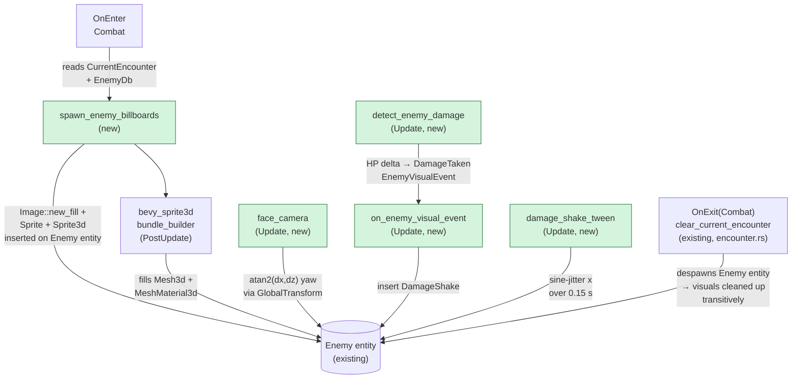

## TL;DR

Spawns enemies as billboarded 3D sprites on combat entry using `bevy_sprite3d 8.0`. Ships 10 enemies with distinct solid-colour placeholders, a 4-state animation machine, and a damage-shake tween — unblocking the visual side of #21 (combat balance) and providing the reusable `spawn_enemy_visual` API that #22 (FOEs) needs for overworld grid placement.

## Why now

Feature #16 (encounter system) landed the encounter-to-combat pipeline and the `Enemy` entity spawn contract. Feature #17 is the first visual layer on top of that: `Enemy` entities were previously invisible. This PR wires the rendering — the next logical step before adding balance data (#21) or walking enemies (#22). Implementation follows `project/plans/20260511-120000-feature-17-enemy-billboard-sprite-rendering.md` and `project/research/20260511-feature-17-enemy-billboard-sprite-rendering.md`.

## How it works

`EnemyRenderPlugin` registers `Sprite3dPlugin` (idempotently) and adds three Update systems plus one `OnEnter(Combat)` system. On combat entry, `spawn_enemy_billboards` reads `CurrentEncounter`, looks up each `EnemySpec.id` in `EnemyDb`, generates a `14×18 px` solid-colour `Image` via `Image::new_fill`, and inserts `Sprite` + `Sprite3d` components onto the existing `Enemy` entity. `bevy_sprite3d`'s PostUpdate `bundle_builder` system fills `Mesh3d` + `MeshMaterial3d<StandardMaterial>` on the same entity. Every frame, `face_camera` rewrites each billboard's yaw via `atan2(dx, dz)` (Y-axis-locked, uses `GlobalTransform` of the child camera). Cleanup is free: `clear_current_encounter` (already in `combat/encounter.rs`) despawns the `Enemy` entity and all attached components transitively.



## Reviewer guide

Start at `src/plugins/combat/enemy_render.rs` — this is the only new source file (~380 LOC of production code, ~370 LOC of tests in the same file). The public API surface is `spawn_enemy_visual` (the seam #22 reuses) and `EnemyRenderPlugin`.

Key spots to read carefully:

- **Lines ~1-80** — constants (`SPRITE_PIXELS_PER_METRE`, `SPRITE_IMAGE_W/H`, `SPRITE_DISTANCE`, `SPRITE_SPACING`, `SPRITE_Y_OFFSET`) and types (`EnemyBillboard`, `EnemyVisual`, `AnimState`, `EnemyVisualEvent`).
- **`spawn_enemy_visual`** — confirm `Image::new_fill` is inside the per-enemy loop, `RenderAssetUsages::RENDER_WORLD` is set, `placeholder_color` channels are clamped, `unlit: true` and `AlphaMode::Mask(0.5)` are set on `Sprite3d`.
- **`face_camera`** — confirm it queries `&GlobalTransform` for `DungeonCamera`, not `&Transform` (camera is a `PlayerParty` child; local transform is meaningless for world-space math). The `Without<DungeonCamera>` filter on the sprite query is load-bearing (Bevy B0001 disjoint-set rule).
- **`on_enemy_visual_event`** — let-chain (not nested `if/if-let`) per clippy 2024 edition rule.
- **`src/data/enemies.rs`** — `EnemyDb` replaced from empty stub. Check `find()` method and the 5 unit tests.
- **`assets/enemies/core.enemies.ron`** — 10-enemy roster. Note `placeholder_color` uses RON tuple notation `(r, g, b)`, not bracket `[r, g, b]` (RON 0.11.0 represents `[f32; 3]` as tuples).
- **Skim** the test-harness additions (`init_asset::<Image>()` and `init_asset::<TextureAtlasLayout>()`) in the 9 affected test apps — mechanical, not logic.

## Scope decisions (user-approved checkpoints)

- **1C — Solid-colour placeholders only:** 10 enemies each have a distinct hue via `placeholder_color: (r, g, b)` in `core.enemies.ron`. Real sprite art (CC0 itch.io packs) is deferred; the `sprite_path: Option<String>` field is already in the schema.
- **2B — 10-enemy roster:** goblin, goblin_captain, cave_spider, hobgoblin, kobold, acid_slime, ice_imp, wraith, cultist, skeleton_lord. Front-loads the balance data #21 needs; the stats for the 3 enemies already referenced in `floor_01.encounters.ron` match exactly (single source of truth).
- **3A — Single-facing sprites:** billboards always face the camera. 4-directional sprites (4× art cost per enemy) revisited at #22 FOEs if the design calls for it.
- **4A → `bevy_sprite3d 8.0` (user-confirmed):** original Option 4A was a manual textured-quad-faces-camera implementation. After user confirmed `bevy_sprite3d 8.0` supports Bevy 0.18 (verified via crates.io + context7 — crate's README version table maps `bevy_sprite3d 8.0 ↔ bevy 0.18`), the plan was revised to use the crate. Saves ~25 LOC, eliminates mesh-orientation pitfall. Note: the crate is NOT an auto-billboard plugin — our `face_camera` system (Y-axis-locked `atan2` yaw, ~10 LOC) stays.

## Deferred (intentional)

- **`AttackStart` / `Died` event producers** — `EnemyVisualEvent` plumbing exists and `on_enemy_visual_event` already has match arms for both variants, but only `DamageTaken` is wired (via `detect_enemy_damage`). The hooks in `turn_manager.rs::execute_combat_actions` are follow-up work for a future PR.
- **Real sprite art** — placeholders only this PR. Schema already has `sprite_path: Option<String>`; a real-art PR is a data swap, not a code change.

## D-Ix deviations from plan

| ID | Description | Reason |
|----|-------------|--------|
| D6 | RON placeholder_color authored as `[r, g, b]` by prior implementer; corrected to `(r, g, b)` tuple notation in all 10 entries | RON 0.11.0 represents `[f32; 3]` as tuple, not bracket array; would have panicked on load |
| D7 | `init_asset::<Image>()` and `init_asset::<TextureAtlasLayout>()` required in ALL 9 test apps using `CombatPlugin`, not just the 3 originally identified | `bevy_sprite3d::bundle_builder` validates these asset registries at system startup even if no `Sprite3d` entities exist; omission causes 48 test panics |
| D8 | `entity_mut().get_mut()` chain in test code split into two named bindings | E0716: borrow-of-dropped-temporary; Rust ownership rule, not a design issue |
| D9 | Nested `if kind == ... { if let Ok(...) { ... } }` in `on_enemy_visual_event` collapsed to let-chain | `clippy::collapsible_if` + Rust 2024 edition; the fix is cleaner anyway |
| D-misc | `DEFAULT_PLACEHOLDER_COLOR` changed from `const` to `pub const` | Silences `dead_code` warning; the constant is part of the public API contract |

## File touch list

| File | Status | Description |
|------|--------|-------------|
| `src/plugins/combat/enemy_render.rs` | NEW | Core billboard plugin: types, systems, 14 tests (~991 LOC) |
| `src/data/enemies.rs` | MODIFIED | `EnemyDb` + `EnemyDefinition` schema replacing empty stub; 5 unit tests |
| `assets/enemies/core.enemies.ron` | MODIFIED | 10-enemy roster replacing `()` placeholder |
| `src/plugins/combat/encounter.rs` | MODIFIED | Populate `EnemyVisual` from `EnemyDb` on spawn |
| `src/plugins/combat/enemy.rs` | MODIFIED | `EnemyBundle` extended with `EnemyVisual` + `EnemyAnimation` |
| `src/plugins/combat/mod.rs` | MODIFIED | `pub mod enemy_render` + `EnemyRenderPlugin` registration |
| `src/data/encounters.rs` | MODIFIED | `#[serde(default)] pub id: String` on `EnemySpec` |
| `assets/encounters/floor_01.encounters.ron` | MODIFIED | Populate `id:` on 5 existing `EnemySpec` entries |
| `Cargo.toml` | MODIFIED | `bevy_sprite3d = "8"` added |
| `src/plugins/combat/turn_manager.rs` | MODIFIED | `init_asset::<Image/TextureAtlasLayout>` in test app |
| `src/plugins/dungeon/features.rs` | MODIFIED | `init_asset::<Image/TextureAtlasLayout>` in test app |
| `src/plugins/dungeon/tests.rs` | MODIFIED | `init_asset::<Image/TextureAtlasLayout>` in test app |
| `tests/dungeon_geometry.rs` | MODIFIED | `init_asset::<EnemyDb/Image/TextureAtlasLayout>` |
| `tests/dungeon_movement.rs` | MODIFIED | `init_asset::<EnemyDb/Image/TextureAtlasLayout>` |
| `src/plugins/combat/ai.rs` | MODIFIED | Minor import cleanup |
| `src/plugins/combat/ui_combat.rs` | MODIFIED | Minor import cleanup |
| Various `.claude/agent-memory/` | MODIFIED | Pipeline and agent memory updates (non-production) |

**14 new tests** — 5 in `data::enemies::tests`, 5 in `combat::enemy_render::tests` (pure unit), 4 in `combat::enemy_render::app_tests` (Bevy ECS integration).

## Verification gate

All 6 quality gates green on commits `9ae9f7f` + `a018f04`:

- `cargo check` (default): clean
- `cargo check --features dev`: clean
- `cargo test` (default): 225 lib + 6 integration = 231 pass
- `cargo test --features dev`: 229 lib + 6 integration = 235 pass
- `cargo clippy --all-targets -- -D warnings` (default): zero warnings
- `cargo clippy --all-targets --features dev -- -D warnings`: zero warnings
- 14 plan grep checks: all pass (see implementation summary for full list)

## Reviewer test plan (manual smoke test required before merge)

Cargo gates do not cover render/input paths. The billboard system is not exercisable by unit or integration tests alone — these items require running the app.

```
cargo run --features dev
```

Trigger an encounter: press **F7** (dev shortcut, registered by the encounter dev plugin) from the dungeon view to force-start combat.

### Manual UI smoke test

What to look for:

- [ ] **Enemy billboards appear in a row** in front of the camera with distinct solid colours (no two enemies the same hue) — D-O2=A (14×18 px placeholders, `pixels_per_metre = 10.0`)
- [ ] **Sprites face the camera** as you rotate: yaw tracks the camera, no roll — D-A1 (`atan2` Y-axis-locked yaw)
- [ ] **Clean despawn on combat exit** (press Escape or let combat resolve): no leaked billboard entities remain in the scene — D-A7 (cleanup via `clear_current_encounter`)
- [ ] **Damage-shake jitter** visible when an enemy takes HP damage: brief x-axis sine-jitter over ~0.15 s — D-O4 (`damage_shake_tween`)
- [ ] **AttackStart / Died animations** — stub; these variants exist in `EnemyVisualEvent` but producers are not wired yet (deferred). No visual feedback expected for these; confirming no panic is sufficient.

## Future dependencies (from roadmap)

- **#22 (FOE / Visible Enemies)** — imports `spawn_enemy_visual(commands, images, entity, placeholder_color, position)` for overworld grid placement. The function is agnostic of combat vs. overworld by design (roadmap §17 Additional Notes).
- **#21 (Loot Tables & Economy)** — consumes the 10-enemy roster in `core.enemies.ron`; the stat blocks for `goblin`, `goblin_captain`, `cave_spider` already match `floor_01.encounters.ron` exactly (single source of truth for balance work).

## Related

- **PR #16** has 3 MEDIUM / 2 LOW review findings still unaddressed (separate concern, not blocking #17).

🤖 Generated with [Claude Code](https://claude.com/claude-code)
