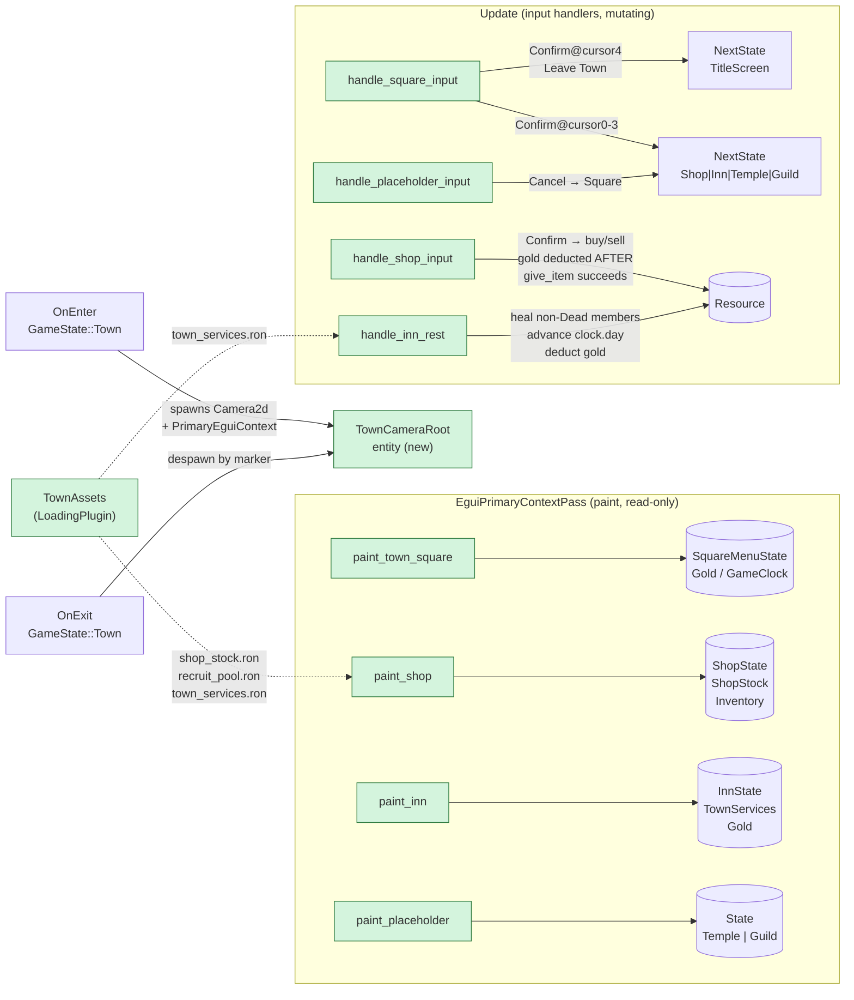

## TL;DR

Wires `GameState::Town` as a working pure-egui hub: Square menu, Shop (buy/sell against party-wide `Gold`, 50% sell-back, 8-item cap), and Inn (full HP/MP heal, clock advance, gold deduction) — all 6 quality gates green (260+6 / 264+6 tests pass). Temple and Guild are "Coming in #18b" placeholder screens; their RON schemas and asset file are already shipped for a zero-migration follow-up.

## Why now

Feature #16 (encounter system) and #17 (enemy billboards) completed the combat loop. Town is the next hub — the player needs somewhere to spend loot, heal the party, and choose the next dungeon run. The foundation was already in tree (`TownLocation` sub-states declared at `src/plugins/state/mod.rs:38-56`, `MenuAction` declared, BGM crossfade wired, `ItemAsset.value` pre-tagged for shop pricing) — #18a is pure systems + UI + data on top of that. Implements per `project/plans/20260511-180000-feature-18a-town-square-shop-inn.md` and `project/research/20260511-feature-18-town-hub-and-services.md`. Zero new Cargo dependencies.

## How it works

`TownPlugin` (formerly a 17-line stub) now spawns a `Camera2d` + `PrimaryEguiContext` on `OnEnter(GameState::Town)` and despawns them via `TownCameraRoot` marker on `OnExit`. One `paint_*` system per sub-state runs in `EguiPrimaryContextPass` (read-only); one `handle_*_input` system per sub-state runs in `Update` (mutates). Both groups are gated with `.distributive_run_if(in_state(GameState::Town))` and `.run_if(in_state(TownLocation::X))`.



## Reviewer guide

Start at `src/plugins/town/mod.rs` — this is the plugin wiring hub. Read `build()` top-to-bottom: camera lifecycle, resource registrations, painter tuple, handler tuple, state guards. About 90 LOC.

Then by sub-state priority:

- **`src/plugins/town/gold.rs`** (~80 LOC) — `Gold(u32)` + `GameClock`. Confirm `try_spend` returns `Err` before touching gold (no silent underflow), `earn` saturates at `u32::MAX`.
- **`src/plugins/town/shop.rs`** — the largest file (~626 LOC). Focus on the `handle_shop_input` success path: inventory-full check BEFORE gold check (line ~300), `give_item` called BEFORE `gold.try_spend` (gold deducted only on `Ok`). `MAX_INVENTORY_PER_CHARACTER = 8` is the Wizardry cap.
- **`src/plugins/town/inn.rs`** (~452 LOC) — confirm `if status.has(StatusEffectType::Dead) { continue; }` guard, clock advance (`day += 1`, `turn = 0`), `services.inn_rest_cost.min(MAX_INN_COST)` clamp.
- **`src/plugins/town/square.rs`** (~238 LOC) — simple cursor navigation. Confirm cursor 4 ("Leave Town") routes to `GameState::TitleScreen`, not `TownLocation`.
- **`src/plugins/town/placeholder.rs`** (~144 LOC) — stub only; Cancel → Square. This file is deleted by #18b.
- **`src/data/town.rs`** (~342 LOC) — RON schemas + `clamp_shop_stock(MAX_SHOP_ITEMS=99)` trust-boundary helper.
- **`src/plugins/loading/mod.rs`** — three `RonAssetPlugin` registrations + `TownAssets` AssetCollection + `.load_collection::<TownAssets>()`.

Pay attention to: `PrimaryEguiContext` is attached to `Camera2d` in the same `commands.spawn(...)` call in `spawn_town_camera` — separating them would cause `ctx_mut() == Err` and silently break all painters.

## Scope / out-of-scope

**In scope:**
- `GameState::Town` with sub-states: Square, Shop, Inn (full service logic), Temple (placeholder), Guild (placeholder)
- `Resource<Gold>` — party-wide u32 with `try_spend`/`earn` saturating helpers
- `Resource<GameClock>` — `day: u32` + `turn: u32`
- `TownAssets` AssetCollection (`shop_stock.ron`, `recruit_pool.ron`, `town_services.ron`)
- Shop: buy (inventory cap 8, gold check, give-first-deduct-second) + sell (50% value, despawn item entity)
- Inn: full HP/MP heal for non-Dead members, cure Poison, advance day, deduct gold
- Square: 5-option menu (Shop / Inn / Temple / Guild / Leave Town → TitleScreen)
- Placeholder screen: "Coming in Feature #18b" for Temple and Guild routes
- Trust-boundary clamps: `clamp_shop_stock(MAX_SHOP_ITEMS=99)`, `inn_rest_cost.min(MAX_INN_COST=10_000)`
- 35 new tests across all new files

**Out of scope (deferred to #18b):**
- Temple service: revive Dead members (`current_hp = 1`) — deferred; `TownServices.temple_revive_cost_base/per_level` fields use `#[serde(default)]` so no RON migration needed
- Temple service: cure severe status effects (Stone, Paralysis, Sleep) — deferred
- Guild: recruit from `RecruitPool` — deferred; `recruit_pool.ron` is already authored and loaded (zero readers in #18a)
- Guild: dismiss party member (including safe `Inventory.0` entity despawn to avoid orphaned `ItemInstance` entities) — deferred
- Guild: row swap (`Front` ↔ `Back`) and slot reorder — deferred
- Character switching in Shop (Tab key to change sell target) — deferred to #25 polish; v1 scopes to first party member only

## Risk and rollback

**Security invariants established in this PR:**

- Gold underflow: `Gold::try_spend` returns `Err(InsufficientGold)` before any subtraction — saturating arithmetic is defense-in-depth only.
- Gold charged before delivery: `buy_item` calls `give_item` first; `gold.try_spend` only executes on `Ok`. A future code path that inverts this order silently charges the player for items they don't receive.
- Inventory overflow: `buy_item` rejects with `BuyError::InventoryFull` when `inventory.0.len() >= 8`. The `Inventory.0: Vec<Entity>` type is unbounded — this guard is the only cap.
- RON trust boundary: `clamp_shop_stock(99)` and `inn_rest_cost.min(10_000)` prevent authored-RON edge cases from crashing the paint loop or making the Inn unaffordable/free. Feature #23 (save/load) must clamp `Gold` on disk read to prevent gold injection from crafted save files — documented at the `Gold` declaration site in `gold.rs`.
- `PrimaryEguiContext` orphaning: spawned and despawned atomically with `Camera2d` under `TownCameraRoot`. Separating them would silently break all painters.

**Rollback:** Revert both commits. No schema or data migration needed — `Gold` and `GameClock` are in-memory only resources in #18a; no save-file writes exist yet. The `TownPlugin` stub (17 lines) is restored from git history.

## Future dependencies (from roadmap)

- **#18b (Temple + Guild)** — imports `TownServices.temple_revive_cost_base`, `temple_revive_cost_per_level`, `temple_cure_costs` (already in schema with `#[serde(default)]`, zero migration). Deletes `placeholder.rs` (single file replacement). Adds readers for `RecruitPool` (already loaded into `TownAssets`).
- **#23 (Save / Load)** — must clamp `Gold(u32)` on disk-read to prevent gold injection from crafted save files. Documented at the `Gold` struct in `gold.rs`.

## Test plan

All 6 quality gates verified GREEN on 2026-05-11:

- [x] `cargo check` — exit 0
- [x] `cargo check --features dev` — exit 0
- [x] `cargo test` — 260 lib + 6 integration tests pass
- [x] `cargo test --features dev` — 264 lib + 6 integration tests pass
- [x] `cargo clippy --all-targets -- -D warnings` — exit 0
- [x] `cargo clippy --all-targets --features dev -- -D warnings` — exit 0

35 new `#[test]` functions added across the new files:

- [x] `town::gold::tests` — 5 tests: `try_spend` insufficient/exact/underflow-guard, `earn` saturate/normal
- [x] `town::square::tests` — 4 tests: confirm@cursor0 → Shop, confirm@cursor4 → TitleScreen, Down/Up wrap
- [x] `town::shop::tests` — 8 tests: inventory cap constant, sell-price integer division, mode defaults, buy error variants distinct, buy rejects full/insufficient-gold, gold deducted only after give
- [x] `town::inn::tests` — 7 tests: full heal living, skips Dead, cures Poison not Stone, advances clock, deducts cost, rejects insufficient gold, fires EquipmentChangedEvent per living member
- [x] `town::placeholder::tests` — 2 tests: Cancel from Temple → Square, Cancel from Guild → Square
- [x] `town::tests (mod.rs)` — 3 tests: plugin builds, camera spawns on enter and despawns on exit, sub-state defaults to Square on enter
- [x] `data::town::tests` — 6 tests: ShopStock RON round-trip, floor filter, clamp truncates oversized, clamp passes small, RecruitPool RON round-trip, TownServices defaulted temple fields

### Manual UI smoke test

Cargo gates do not cover egui render paths or input handling. Reviewers should also exercise the new Town screens manually.

```
cargo run --features dev
```

Press **F9** to cycle through `GameState`s until you land on `GameState::Town` (Town Square menu appears with Gold balance and Day counter in the header).

What to look for:

- [ ] **Town Square menu renders** — 5 options visible: Shop, Inn, Temple, Guild, Leave Town. Gold balance + "Day 0" in header.
- [ ] **Down/Up navigation wraps** — cursor highlights in yellow; wraps from bottom back to top.
- [ ] **Shop screen** — Confirm on "Shop" opens Shop in Buy mode. Item list renders with prices. Press Left/Right to switch Buy/Sell. Confirm on an item: gold decreases (if sufficient), item appears in party inventory. Press Esc → back to Square.
- [ ] **Inn screen** — Confirm on "Inn" opens Inn. Cost displayed ("Rest costs 10 Gold"). Confirm Rest: party HP/MP restored to max (check via stat display if available), gold decreases by 10, Day counter increments to 1. Press Esc → back to Square.
- [ ] **Temple placeholder** — Confirm on "Temple" shows "Coming in Feature #18b — Press Esc to return". Press Esc → back to Square.
- [ ] **Guild placeholder** — Confirm on "Guild" shows "Coming in Feature #18b — Press Esc to return". Press Esc → back to Square.
- [ ] **Leave Town** — Confirm on "Leave Town" (cursor 4) transitions to `GameState::TitleScreen`. No crash, no leaked Town camera entity.
- [ ] **Insufficient gold guard** — If gold is 0 and you try to buy/rest, operation is rejected (logged to console); gold stays 0.

Stubs not exercisable in this PR: Temple revive, Temple cure, Guild recruit/dismiss/row-swap — all deferred to #18b.

🤖 Generated with [Claude Code](https://claude.com/claude-code)
