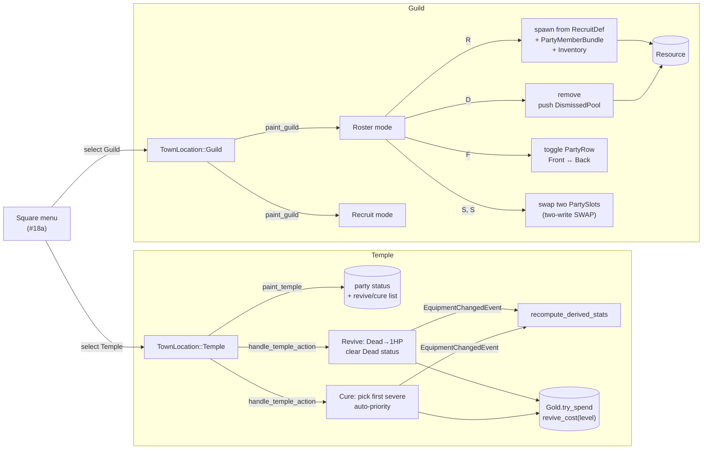

## TL;DR

Replaces #18a's `placeholder.rs` stub with real **Temple** and **Guild** screens, completing the five-screen Town hub envisioned in roadmap §18. Temple revives the dead and cures Stone / Paralysis / Sleep for gold; Guild lets the party recruit from a pre-authored pool, dismiss members (entity preserved), reorder slots (SWAP), and toggle front/back row. All 6 quality gates green; 292 lib + 6 integration tests pass (296+6 under `--features dev`), +33 net tests vs #18a baseline.

## Why now

#18a (PR #18, merged) shipped Square + Shop + Inn and left Temple + Guild as `"Coming in #18b"` placeholder screens. The asset schema was already authored eagerly: `core.town_services.ron` had `temple_*` fields with `#[serde(default)]`, and `core.recruit_pool.ron` had 5 pre-authored recruits ready to read. #18b is a pure additive on top of that foundation — no schema migration, no new Cargo deps.

## How it works

## Reviewer guide

Start at **`src/plugins/town/mod.rs`** for the wiring — TownPlugin now registers `paint_temple` / `paint_guild` painters and five Guild handlers (input, recruit, dismiss, row_swap, slot_swap) plus `handle_temple_action`. The placeholder module is gone.

Then by file, by priority:

- **`src/plugins/town/temple.rs`** (~285 LOC, 15+ tests) — Focus on `revive_cost` (saturating `base + per_level*level` clamped to `[1, MAX_TEMPLE_COST]`), `cure_cost` (None for Dead — Revive is the sole Dead-removal path), and `first_curable_status` (priority Stone > Paralysis > Sleep, skips Poison and buffs). `handle_temple_action` fires `EquipmentChangedEvent { slot: EquipSlot::None }` per healed/revived member so derived stats recompute via the existing pipeline (mirrors Inn's pattern).
- **`src/plugins/town/guild.rs`** (~680 LOC, 15+ tests) — Largest file. `paint_guild` has a sorted-by-PartySlot roster view + a recruit list with R/D/F/S keybinds. `handle_guild_recruit` spawns `PartyMemberBundle` chained with `.insert(Inventory::default())`. `handle_guild_dismiss` calls `commands.entity(target).remove::<PartyMember>()` + pushes to `pool.entities` — **the entity is preserved**, never despawned, so the Inventory chain stays intact for #19 re-recruit. `handle_guild_slot_swap` is a two-press UX (first S pins source, second S resolves and exchanges). `handle_guild_row_swap` toggles `PartyRow` on the cursor-targeted member.
- **`src/data/town.rs`** — Adds `MAX_TEMPLE_COST = 100_000`, `MAX_RECRUIT_POOL = 32`, `clamp_recruit_pool` (trust-boundary helper). `TownServices.temple_*` fields are now populated in `core.town_services.ron`.
- **`assets/town/core.town_services.ron`** — Adds `temple_revive_cost_base: 100`, `temple_revive_cost_per_level: 50`, `temple_cure_costs: [(Stone, 250), (Paralysis, 100), (Sleep, 50)]`.
- **`src/plugins/town/placeholder.rs`** — **deleted**. Module declaration removed from `mod.rs`.

## Scope

**In scope (this PR):**
- `TownLocation::Temple` painter + handler — revive Dead, cure Stone/Paralysis/Sleep
- `TownLocation::Guild` painter + 5 handlers — roster, recruit, dismiss, row swap, slot swap
- `Resource<DismissedPool>` (entity preserved, save-format deferred to #23)
- `core.town_services.ron` Temple fields populated
- 30+ new tests (15 temple, 15 guild)

**Out of scope (future):**
- Full character creation UI (race/class/name picker) — Feature **#19**
- `MapEntities` impl for `DismissedPool` save/load — Feature **#23**
- Multi-character SHOP `party_target` cycling — Feature **#25**

## User decisions (locked in plan, no surprises)

| # | Decision | Resolved |
|---|----------|----------|
| 1 | Dismiss scope | Ship now with `Resource<DismissedPool>` |
| 2 | Temple cure set | `Dead` + `Stone` + `Paralysis` + `Sleep` (Inn handles `Poison`) |
| 3 | Revive cost formula | `base=100 + per_level×50` saturating, clamped to `MAX_TEMPLE_COST` |
| 4 | Cure cost values | `Stone=250`, `Paralysis=100`, `Sleep=50` (flat, not level-scaled) |
| 5 | Slot reorder semantics | SWAP (two-write op) |
| 6 | Recruit while party empty | Allow (forward-compat with #19); min-1-active applies to Dismiss only |
| 7 | Multi-status Cure UX | Auto-pick first eligible (priority Stone > Paralysis > Sleep) |
| 8 | `DismissedPool` save format | Defer `MapEntities` to #23 |

## Quality gates (all green)

| Gate | Command | Result |
|------|---------|--------|
| 1 | `cargo check` | exit 0 |
| 2 | `cargo check --features dev` | exit 0 |
| 3 | `cargo test` | **292 lib + 6 integration tests** pass |
| 4 | `cargo test --features dev` | **296 lib + 6 integration tests** pass |
| 5 | `cargo clippy --all-targets -- -D warnings` | exit 0 |
| 6 | `cargo clippy --all-targets --features dev -- -D warnings` | exit 0 |

## Risk

Low. All changes are additive within an established Town-screen pattern. The two real semantic risks are:
1. **Dismiss preserves entity** (no despawn) — Inventory and any future XP/equipment history travel with the dismissed entity into `DismissedPool`. If #19 ever wants to wipe history on dismiss, that's an explicit follow-up.
2. **Revive order-of-operations** — `effects.retain(!= Dead)` BEFORE `current_hp = 1`. Reversing would zero the player due to clamping. Test `revive_clears_dead_then_sets_hp_to_1` guards this.

## Test plan

- [x] All 6 quality gates exit 0 (logged in commit body)
- [x] +33 net tests vs #18a baseline (verified)
- [ ] Manual smoke (GPU/display required): `cargo run --features dev`, F4 to grant +500 gold, F9 cycle to Town, navigate to Temple → revive a Dead member → confirm HP=1 and Dead status cleared. Navigate to Guild → recruit one member → dismiss another → row-swap with F → slot-swap with two S presses.

## Awaiting

- **Manual smoke test** by reviewer (GPU required).
- **Merge authorization** for this PR.

🤖 Generated with [Claude Code](https://claude.com/claude-code)
