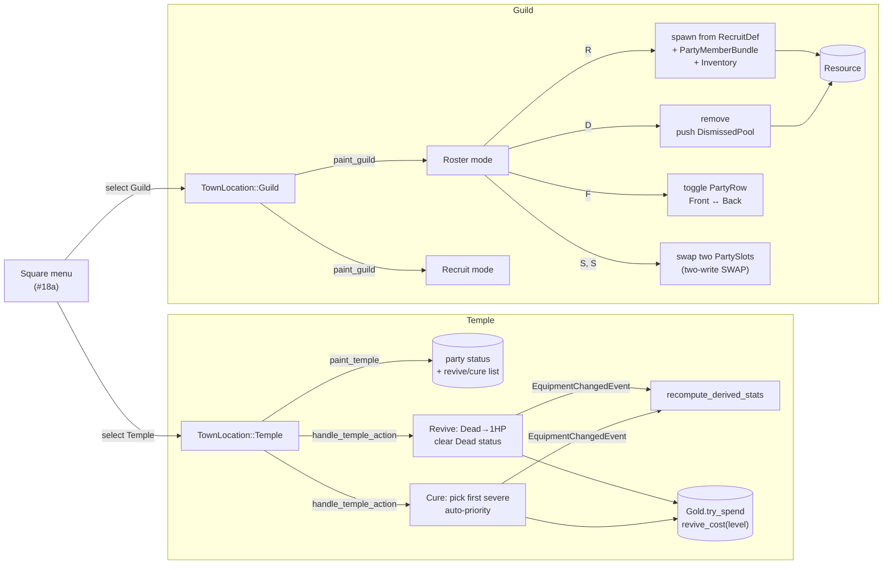

## TL;DR

Replaces #18a's `placeholder.rs` stub with real **Temple** and **Guild** screens, completing the five-screen Town hub envisioned in roadmap §18. Temple revives the dead and cures Stone / Paralysis / Sleep for gold; Guild lets the party recruit from a pre-authored pool, dismiss members (entity preserved), reorder slots (SWAP), and toggle front/back row. All 6 quality gates green; 292 lib + 6 integration tests pass (296+6 under `--features dev`), +33 net tests vs #18a baseline.

## Why now

#18a (PR #18, merged) shipped Square + Shop + Inn and left Temple + Guild as `"Coming in #18b"` placeholder screens. The asset schema was already authored eagerly: `core.town_services.ron` had `temple_*` fields with `#[serde(default)]`, and `core.recruit_pool.ron` had 5 pre-authored recruits ready to read. #18b is a pure additive on top of that foundation — no schema migration, no new Cargo deps.

## How it works

## Reviewer guide

Start at **`src/plugins/town/mod.rs`** for the wiring — TownPlugin now registers `paint_temple` / `paint_guild` painters and five Guild handlers (input, recruit, dismiss, row_swap, slot_swap) plus `handle_temple_action`. The placeholder module is gone.

Then by file, by priority:

- **`src/plugins/town/temple.rs`** (~285 LOC, 15+ tests) — Focus on `revive_cost` (saturating `base + per_level*level` clamped to `[1, MAX_TEMPLE_COST]`), `cure_cost` (None for Dead — Revive is the sole Dead-removal path), and `first_curable_status` (priority Stone > Paralysis > Sleep, skips Poison and buffs). `handle_temple_action` fires `EquipmentChangedEvent { slot: EquipSlot::None }` per healed/revived member so derived stats recompute via the existing pipeline (mirrors Inn's pattern).
- **`src/plugins/town/guild.rs`** (~680 LOC, 15+ tests) — Largest file. `paint_guild` has a sorted-by-PartySlot roster view + a recruit list with R/D/F/S keybinds. `handle_guild_recruit` spawns `PartyMemberBundle` chained with `.insert(Inventory::default())`. `handle_guild_dismiss` calls `commands.entity(target).remove::<PartyMember>()` + pushes to `pool.entities` — **the entity is preserved**, never despawned, so the Inventory chain stays intact for #19 re-recruit. `handle_guild_slot_swap` is a two-press UX (first S pins source, second S resolves and exchanges). `handle_guild_row_swap` toggles `PartyRow` on the cursor-targeted member.
- **`src/data/town.rs`** — Adds `MAX_TEMPLE_COST = 100_000`, `MAX_RECRUIT_POOL = 32`, `clamp_recruit_pool` (trust-boundary helper). `TownServices.temple_*` fields are now populated in `core.town_services.ron`.
- **`assets/town/core.town_services.ron`** — Adds `temple_revive_cost_base: 100`, `temple_revive_cost_per_level: 50`, `temple_cure_costs: [(Stone, 250), (Paralysis, 100), (Sleep, 50)]`.
- **`src/plugins/town/placeholder.rs`** — **deleted**. Module declaration removed from `mod.rs`.

## Scope

**In scope (this PR):**
- `TownLocation::Temple` painter + handler — revive Dead, cure Stone/Paralysis/Sleep
- `TownLocation::Guild` painter + 5 handlers — roster, recruit, dismiss, row swap, slot swap
- `Resource<DismissedPool>` (entity preserved, save-format deferred to #23)
- `core.town_services.ron` Temple fields populated
- 30+ new tests (15 temple, 15 guild)

**Out of scope (future):**
- Full character creation UI (race/class/name picker) — Feature **#19**
- `MapEntities` impl for `DismissedPool` save/load — Feature **#23**
- Multi-character SHOP `party_target` cycling — Feature **#25**

## User decisions (locked in plan, no surprises)

| # | Decision | Resolved |
|---|----------|----------|
| 1 | Dismiss scope | Ship now with `Resource<DismissedPool>` |
| 2 | Temple cure set | `Dead` + `Stone` + `Paralysis` + `Sleep` (Inn handles `Poison`) |
| 3 | Revive cost formula | `base=100 + per_level×50` saturating, clamped to `MAX_TEMPLE_COST` |
| 4 | Cure cost values | `Stone=250`, `Paralysis=100`, `Sleep=50` (flat, not level-scaled) |
| 5 | Slot reorder semantics | SWAP (two-write op) |
| 6 | Recruit while party empty | Allow (forward-compat with #19); min-1-active applies to Dismiss only |
| 7 | Multi-status Cure UX | Auto-pick first eligible (priority Stone > Paralysis > Sleep) |
| 8 | `DismissedPool` save format | Defer `MapEntities` to #23 |

## Quality gates (all green)

| Gate | Command | Result |
|------|---------|--------|
| 1 | `cargo check` | exit 0 |
| 2 | `cargo check --features dev` | exit 0 |
| 3 | `cargo test` | **292 lib + 6 integration tests** pass |
| 4 | `cargo test --features dev` | **296 lib + 6 integration tests** pass |
| 5 | `cargo clippy --all-targets -- -D warnings` | exit 0 |
| 6 | `cargo clippy --all-targets --features dev -- -D warnings` | exit 0 |

## Risk

Low. All changes are additive within an established Town-screen pattern. The two real semantic risks are:
1. **Dismiss preserves entity** (no despawn) — Inventory and any future XP/equipment history travel with the dismissed entity into `DismissedPool`. If #19 ever wants to wipe history on dismiss, that's an explicit follow-up.
2. **Revive order-of-operations** — `effects.retain(!= Dead)` BEFORE `current_hp = 1`. Reversing would zero the player due to clamping. Test `revive_clears_dead_then_sets_hp_to_1` guards this.

## Post-ship polish (added after initial commit)

Items picked up during manual testing of the open PR — included here rather than
chained as a follow-up because none are big enough to ship separately:

- **Temple revive/cure now targets the right member.** Sort order across Temple
  painter, Temple handler, and dev hotkeys is unified on `PartySlot.0`
  (previously the painter sorted by Entity while dev keys hit `iter().next()`).
  Visible cursor + per-member status badges (`[DEAD]`, `[STONE]`, `[PARALYSIS]`,
  `[SLEEP]`, `[POISON]`) make selection unambiguous.
- **Dev hotkeys for test setup** (`--features dev`): F1 = apply Dead to slot 0;
  F2 = Poison; F3 = Stone+Paralysis+Sleep (all three for testing Temple's
  auto-pick priority Stone > Paralysis > Sleep). F4 = +500 gold (existing).
- **Recruit dedup.** New `Resource<RecruitedSet>` prevents the same pool index
  from being recruited twice; painter shows `"(recruited)"` next to taken
  entries; handler rejects duplicates.
- **Layout-aware key bindings.** `apply_logical_key_bindings` (already present
  for `DungeonAction`) extended to `MenuAction` — Guild verbs (R/G/F/T) and
  party-target cycling (`[`/`]`) work on Dvorak/AZERTY/Colemak via the
  keycap-labeled keys, not just QWERTY physical positions.
- **Shop sell labels** show item names from `ItemAsset.display_name` instead of
  `"item slot N"`, plus the per-item sell price preview.
- **Shop party-target cycling.** `[`/`]` cycles which member buys/sells.
  Bottom-of-screen party strip shows current bag counts and highlights the
  active member.
- **Toast notification system** (`src/plugins/town/toast.rs`). Every action
  (Temple revive/cure, Inn rest, Shop buy/sell, Guild recruit/dismiss/row/slot
  swap) pushes a top-center on-screen message with 3-second TTL and fade-out.
  Failure paths also toast (`"Not enough gold (N needed)."`, `"Inventory
  full."`, `"Mira is already in your party."`, etc.).
- **Temple and Inn no longer auto-return to Square** after a successful action.
  Esc/Cancel is the only exit so a player can revive multiple dead members or
  rest several days without re-entering the screen each time.
- **Guild header shows current mode** (`Guild — Roster` / `Guild — Recruit`)
  matching the Shop pattern.
- **Party-spawn-on-Town-entry** (carried over from #18a follow-up): party also
  spawns on `OnEnter(GameState::Town)` so testers entering Town directly via
  F9 cycle without going through Dungeon still have party members to act on.

Test count delta from this polish: **+6 new tests** (recruit dedup, Temple
revive/cure no-auto-return, Inn rest no-auto-return, two toast TTL paths).

## Test plan

- [x] All 6 quality gates exit 0 (logged in commit body — re-verified after polish)
- [x] **305 lib + 6 integration tests pass** (`cargo test --features dev`)
  — +6 vs the initial #18b commit, +39 vs #18a baseline.
- [x] No new Cargo dependencies.
- [ ] **Manual smoke** (GPU/display required):
  - `cargo run --features dev`
  - F4 → grant +500 gold (a few times)
  - F9 → cycle to Town
  - **Temple — revive:** F1 (kill slot 0), enter Temple, confirm `[DEAD]` badge
    next to slot 0 → Enter → toast `"X has been revived! (Ng)"`, badge gone,
    screen stays open.
  - **Temple — cure (single):** F2-equivalent for Stone via F3, enter Temple,
    Left/Right toggle to Cure mode, Enter cures Stone → toast → still in
    Temple. Press Enter again to cure Paralysis, then Sleep. Esc to exit.
  - **Temple — cure (Inn flow):** F2 to apply Poison, go to Inn, Enter rests
    the party (heals Poison since Inn cures Poison) → toast `"Party rested.
    (10g) — Day N."` → still in Inn. Esc to exit.
  - **Inn — insufficient gold:** spend down to <10g, press Enter → toast `"Not
    enough gold to rest (10g needed)."` → still in Inn.
  - **Shop — buy:** enter Shop, Up/Down to pick an item, Enter → toast `"Bought
    Rusty Sword for Ng."` Try `[` and `]` to cycle which member receives the
    item; check the party strip at the bottom highlights the active member.
  - **Shop — sell:** Left/Right toggle to Sell mode; confirm items show
    by display name (e.g. `"Rusty Sword — sells for 12 gold"`), not `"item slot
    N"`. Cycle members with `[`/`]`; bag count updates.
  - **Shop — inventory full / broke:** fill a member's bag to 8 then try to buy
    → toast `"Inventory full."` Drop gold below an item price → toast `"Not
    enough gold (N needed)."`
  - **Guild — header:** Confirm the top of the screen reads `"Guild — Roster"`
    by default and switches to `"Guild — Recruit"` after R.
  - **Guild — recruit:** R toggles to Recruit mode, Up/Down to pick, Enter →
    toast `"X has joined your party!"` and the entry in the recruit panel now
    shows `"(recruited)"`. Press Enter on the same entry → toast `"X is already
    in your party."`
  - **Guild — dismiss / row swap / slot swap:** back to Roster (R), pick a
    member with Up/Down, G to dismiss → toast `"Dismissed X."`. F to toggle
    front/back row → toast `"X moved to Back row."`. T then move cursor then T
    again → toasts `"Slot swap: pinned X..."` then `"Swapped X ↔ Y."`
  - **Dvorak keyboard:** switch OS layout to Dvorak; confirm the R/G/F/T
    labeled keycaps still trigger Recruit/Dismiss/RowSwap/SlotSwap, and `[`/`]`
    keycaps still cycle party target.

## Awaiting

- **Manual smoke test** by reviewer (GPU required).
- **Merge authorization** for this PR.

🤖 Generated with [Claude Code](https://claude.com/claude-code)
