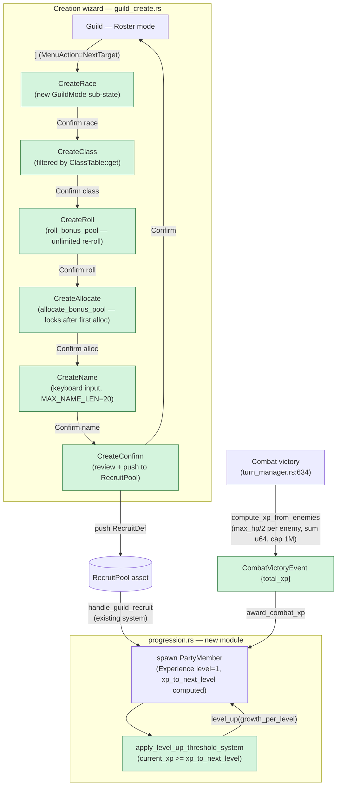

## TL;DR

Feature #19 ships the full character-creation wizard (race → class → roll stats → name → confirm), a pure-function leveling/XP system, a five-race RON asset, extended `ClassDef` schema, and a combat-victory XP hook. MVP class roster is Fighter / Mage / Priest only; unauthrored classes (Thief / Bishop / Samurai / Lord / Ninja) are filtered out at the UI layer via `ClassTable::get(c).is_some()` — adding them later is a RON-only change.

## Why now

#18b (PR #19, merged) shipped Temple + Guild roster with entity-preserved `DismissedPool` and a stub character pool (`core.recruit_pool.ron`). #11 supplied `PartyMember` / `BaseStats` / `Experience` / `Class` / `Race` data types. This PR wires them together: the wizard uses the types, the RON assets, and the `RecruitPool` → `handle_guild_recruit` plumbing already in place. No schema migration; zero new Cargo dependencies.

Plan: `project/plans/20260513-120000-feature-19-character-creation.md`
Pre-ship review: `project/reviews/20260513-feature-19-character-creation.md` — 1 HIGH + 2 MEDIUM fixed; 1 LOW deferred.

## How it works



## Reviewer guide

Start at **`src/plugins/town/guild_create.rs`** — that's the new wizard. The six `GuildMode::CreateXxx` variants and the `CreationDraft` resource are the entry points. `handle_guild_create_input` dispatches by mode; `handle_guild_create_confirm` pushes the finished `RecruitDef`.

Then by file, in priority order:

- **`src/plugins/party/progression.rs`** (~300 LOC, 16 tests) — Pure functions: `xp_for_level`, `roll_bonus_pool`, `allocate_bonus_pool`, `can_create_class`, `level_up`, `recompute_xp_to_next_level`. Handler systems: `award_combat_xp` (reads `CombatVictoryEvent`), `apply_level_up_threshold_system` (threshold check each frame). Pay attention to the `Experience` initialization at `guild.rs:423` — the HIGH fix ensures `level=1` with a computed `xp_to_next_level`, not `Default::default()`.
- **`src/plugins/combat/turn_manager.rs:605-640`** — The combat-XP hook. `compute_xp_from_enemies` uses `u64` accumulation (MEDIUM fix); the `.min(1_000_000) as u32` cast is safe because the intermediate value is bounded.
- **`src/data/races.rs`** + **`assets/races/core.races.racelist.ron`** — `RaceData` / `RaceTable` schema. `stat_modifiers` fields are `u16` encoding i16 two's-complement (e.g., `-1 == 65535`). Applied via `saturating_add_signed(modifier as i16)` in `allocate_bonus_pool`. The Hobbit `LCK+3` asymmetry is intentional (Wizardry-tradition "lucky" Hobbits — flagged as INFO in pre-ship review, not a bug).
- **`assets/classes/core.classes.ron`** — Six new `#[serde(default)]` fields on `ClassDef` (`xp_to_level_2`, `xp_curve_factor`, `growth_per_level`, `stat_minimums`, `advancement_requirements`, `stat_penalty_on_change`). All backward-compatible; existing entries without them load fine.
- **`src/plugins/town/guild.rs`** — Look at `handle_guild_recruit` to confirm the `Experience` initialization fix (HIGH). Also check the new `GuildMode::CreateXxx` arms in `paint_guild` and `handle_guild_input`.
- **`src/plugins/town/mod.rs`** + **`src/plugins/party/mod.rs`** + **`src/data/mod.rs`** — Wiring: `PartyProgressionPlugin`, `RonAssetPlugin::<RaceTable>`, registration of `CombatVictoryEvent`, `ProgressionRng` resource init.

Skim the test modules (`#[cfg(test)]` at the bottom of each file) — 26 new tests total.

## Scope / out-of-scope

**In scope:**
- Six-step creation wizard extending `GuildMode` enum (`guild_create.rs`, new sibling of `guild.rs`)
- `progression.rs` module: `ProgressionRng`, `CombatVictoryEvent`, pure math functions, threshold handler, XP-award system
- `RaceData` / `RaceTable` structs + `assets/races/core.races.racelist.ron` (5 races)
- `ClassDef` extended with 6 new `#[serde(default)]` fields (backwards-compatible RON)
- Fighter, Mage, Priest class definitions authored with full progression curves
- Combat-XP hook at `turn_manager.rs:634` — `compute_xp_from_enemies` helper
- Post-review fixes: HIGH ghost-level-up, MEDIUM u32→u64 XP sum, MEDIUM `recompute_xp_to_next_level` doc annotation
- 26 new tests

**Out of scope (deferred):**
- Thief, Bishop, Samurai, Lord, Ninja class definitions — filtered by `ClassTable::get(c).is_some()`; adding them is RON-only, no Rust changes required
- Class-change UI — `advancement_requirements` and `stat_penalty_on_change` are authored on `ClassDef` but no mutation system exists yet; targeted for #21+
- Stochastic stat growth — `level_up` accepts `_rng`/`_current` params (underscore-prefixed) for forward-compat; intentionally deferred LOW finding from pre-ship review
- Combat-gold awards — `CombatVictoryEvent.total_gold` is always 0 in v1; gold drops are #21 (Loot Tables)
- `DismissedPool` `MapEntities` for save/load — #23 (Save / Load System)

## User decisions (locked in plan)

| # | Question | Decision |
|---|----------|----------|
| Q1 | Stat allocation | Bonus-pool (1B); unlimited re-roll; re-roll locks on first allocate |
| Q2 | MVP class roster | 2A: Fighter / Mage / Priest only |
| Q3 | Race set | 3A: All 5 races day-one (Human, Elf, Dwarf, Gnome, Hobbit) |
| Q4 | Creation destination | 4A: Push to `RecruitPool`; auto-switch to Recruit mode, cursor on new entry |
| Q5 | XP curve | 5A: Per-class formula `xp_to_level_2 * xp_curve_factor.powi(level-1)` |
| Q6 | Class-change stat penalty | 6C: None (data-only day-one; no mutation system) |
| Q7 | Level cap | 7B: 99 hard cap; `current_xp` accumulates above threshold |

## Notable invariants for reviewer attention

- **Discriminant order is LOCKED.** `Class`, `Race`, and `BaseStats` field order must remain stable for save-format compatibility. Future class/race additions must append, never reorder.
- **`Experience.xp_to_next_level` is a CACHE.** Any site that mutates `Class` or `Experience.level` must call `recompute_xp_to_next_level`. Currently: `apply_level_up_threshold_system` maintains it. No class-change site exists yet — advisory for #21+.
- **Hobbit LCK+3 asymmetry** is intentional (Wizardry-tradition design). Net sum of Hobbit modifiers is +1. The pre-ship review flagged this as INFO, not a bug.

## Risk and rollback

Low. All changes are additive within established patterns. Specific risks:

1. **Ghost level-up (HIGH, fixed)** — The `Experience::default()` path (`level=0, xp_to_next_level=0`) would immediately trigger `apply_level_up_threshold_system`. Fixed by initializing `Experience { level: 1, xp_to_next_level: computed }` in `handle_guild_recruit`. Regression test `recruit_does_not_trigger_ghost_level_up` guards this.
2. **XP sum overflow (MEDIUM, fixed)** — `compute_xp_from_enemies` now accumulates into `u64` before clamping and casting. Guarded by `xp_from_single_enemy_clamped` and `xp_sum_does_not_overflow_with_many_enemies` tests.
3. **`stat_modifiers` u16/i16 encoding** — negative race modifiers are stored as two's-complement `u16` bit patterns and must be interpreted via `field as i16`. Misread as raw `u16` would produce bogus stats. The encoding is documented in `races.rs` module doc and at every apply site in `progression.rs`.

Rollback: revert this commit. No schema migration; no data migration. The `ClassDef` extension fields all have `#[serde(default)]` so reverting does not break existing RON assets.

## Future dependencies (from roadmap)

- **#20 (Spells & Skill Trees)** — imports `Class`, `Experience.level`, and the per-class skill-tree hook. Depends on `ClassDef.xp_curve_factor` being stable (locked discriminant order) and `apply_level_up_threshold_system` remaining the sole level-up mutator.

## Test plan

- [x] `cargo check` — exit 0
- [x] `cargo check --features dev` — exit 0
- [x] `cargo test` — **322 lib + 1 integration test pass** (+26 vs #18b baseline of ~296)
- [x] `cargo test --features dev` — **322 lib + 1 integration test pass**
- [x] `cargo clippy --all-targets -- -D warnings` — exit 0
- [x] `cargo clippy --all-targets --features dev -- -D warnings` — exit 0
- [x] No new Cargo dependencies (`Cargo.toml` delta: 0 new deps)

**26 new tests distributed across:**
- `src/plugins/party/progression.rs` — XP curve math, roll_bonus_pool, allocate_bonus_pool, level_up, apply_level_up_threshold_system, ghost-level-up regression
- `src/plugins/town/guild_create.rs` — wizard step transitions, name length enforcement, class filter (authored vs unauthrored), creation-to-recruit-pool round-trip
- `src/data/races.rs` — RaceData deserialization, i16-encoded stat modifier application
- `src/plugins/combat/turn_manager.rs` — `compute_xp_from_enemies` single-enemy clamp, u64 overflow safety
- `src/plugins/town/guild.rs` — `recruit_does_not_trigger_ghost_level_up` regression

### Manual UI smoke test

Cargo gates don't cover render/input paths. Reviewers should also exercise the new creation wizard manually.

```
cargo run --features dev
```

Press F9 to cycle `GameState`s until you land on `GameState::Town`, then navigate to Guild.

What to look for:

- [ ] **Roster mode header** shows `"Guild — Roster"` by default
- [ ] **Press `]`** — screen switches to the creation wizard, first step `"Create — Race"` — Q3=3A
- [ ] **Race list** shows exactly 5 entries: Human, Elf, Dwarf, Gnome, Hobbit — Q3=3A
- [ ] **Select Hobbit → Confirm** — transitions to `"Create — Class"` step
- [ ] **Class list** shows exactly 3 entries: Fighter, Mage, Priest (not Thief/Bishop/Samurai/Lord/Ninja) — Q2=2A
- [ ] **Select Fighter → Confirm** — transitions to `"Create — Roll"` step
- [ ] **Roll step** shows bonus pool total; pressing roll-again key re-rolls — Q1=1B
- [ ] **Confirm roll** — transitions to `"Create — Allocate"` step; re-roll key now locked
- [ ] **Allocate** distribute pool across STR/INT/PIE/VIT/AGI/LCK; total stays ≤ pool
- [ ] **Confirm allocate** — transitions to `"Create — Name"` step
- [ ] **Type a name longer than 20 chars** — characters beyond 20 are rejected (MAX_NAME_LEN=20 enforcement)
- [ ] **Confirm name** — transitions to `"Create — Confirm"` review screen
- [ ] **Confirm creation** — transitions back to Guild Roster, then to Recruit mode with cursor on new entry; toast `"X is ready to recruit!"` or equivalent — Q4=4A
- [ ] **Recruit the new character** — they appear in the party at level 1 (not level 0); no ghost level-up — HIGH fix
- [ ] **Esc at any wizard step** — returns to Roster mode, `CreationDraft` cleared

To exercise the XP hook: After recruiting and entering a combat encounter (F9 to cycle to Dungeon), winning a fight should award XP and show the party's `Experience.current_xp` increasing. Level-up fires when threshold is crossed.

🤖 Generated with [Claude Code](https://claude.com/claude-code)
