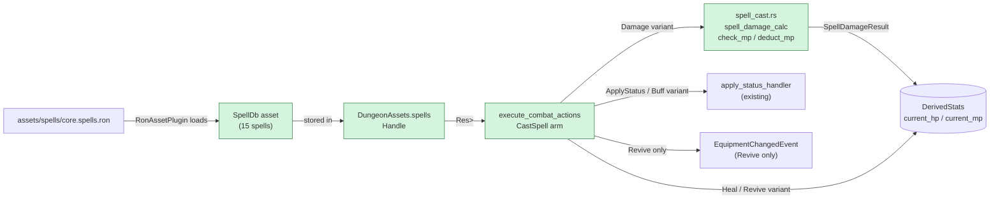

## TL;DR

Replaces the empty `SpellTable` stub with a data-driven `SpellDb` + 15 starter Wizardry-style spells, and wires `CastSpell` in `execute_combat_actions` to a real multi-effect resolver. `SpellMenu` UI stays a stub — that ships in Phase 3 (#20c).

## Why now

Feature #20 was planned as three independent PRs. Phase 1 (this PR) is the minimum foundation that Phases 2 and 3 depend on: the asset schema, the 15 starter spells, and the resolver that actually executes `CombatActionKind::CastSpell { spell_id }` actions queued by the turn manager. Without Phase 1 merged, Phase 2 (skill trees + SP allocation) has no `SpellDb` to reference, and Phase 3 (SpellMenu UI) has no resolver to invoke.

Plan: `project/plans/20260514-120000-feature-20-spells-skill-tree.md` §Phase 1 (Steps 1.1–1.8).
Implementation summary: `project/implemented/20260514-120000-feature-20a-spell-registry.md`.

## How it works

`SpellDb` is a Bevy asset loaded from `assets/spells/core.spells.ron` via `RonAssetPlugin`. The resolver in `execute_combat_actions` looks up the spell by string id, gates on MP and Silence, deducts MP, resolves targets via the existing `resolve_target_with_fallback`, then dispatches on `SpellEffect` variant. Damage and status paths delegate to pure functions in the new `spell_cast` module (mirroring `damage.rs`).



## Reviewer guide

- **Start at `src/plugins/combat/spell_cast.rs`** — this is the new pure-function module. Read the module doc for the damage formula, then skim `spell_damage_calc`, `check_mp`, `deduct_mp`. ~150 LOC.
- **Then `src/plugins/combat/turn_manager.rs` lines 547–818** — the `CastSpell` arm in `execute_combat_actions`. This is the largest new block; read it top-to-bottom once following the numbered comments (1–7).
- **Skim `src/data/spells.rs`** — the schema. Pay attention to `SpellEffect` variants (APPEND-ONLY) and the `MAX_*` constants block.
- **Glance at `assets/spells/core.spells.ron`** — 15 spells, Wizardry names. Verify the double-dot extension (`.spells.ron`) is correct for `RonAssetPlugin` routing.
- **Skip** `src/data/mod.rs`, `src/plugins/loading/mod.rs`, `src/plugins/combat/mod.rs` — mechanical re-exports and a one-liner `pub mod spell_cast;`.
- **Pay attention to the Revive arm** (lines 751–806) — it's the one place that mutates `StatusEffects` directly via `effects.retain` rather than going through `apply_status_handler`. This is an intentional exception documented in the code and plan.

## Scope / out-of-scope

**In scope (Phase 1):**
- `SpellId`, `SpellSchool`, `SpellTarget`, `SpellEffect`, `SpellAsset`, `SpellDb`, `SpellCombatant`, `SpellDamageResult` types
- `MAX_SPELL_MP_COST`, `MAX_SPELL_DAMAGE`, `MAX_SPELL_HEAL`, `MAX_SPELL_DURATION`, `KNOWN_SPELLS_MAX` constants
- 15 starter spells in `assets/spells/core.spells.ron` (8 Mage: Halito, Mahalito, Katino, Tiltowait, Dilto, Mogref, Sopic, Lokara; 7 Priest: Dios, Madios, Madi, Matu, Bamatu, Kalki, Di)
- Full `CastSpell` resolver in `execute_combat_actions` (all 6 `SpellEffect` variants)
- 19 new tests (6 `data/spells.rs` + 5 `spell_cast.rs` + 7 `turn_manager.rs::cast_spell_*` + 1 `tests/spell_db_loads.rs`)
- 4 test fixture updates: `spell_table: Handle::default()` → `spells: Handle::default()` in `minimap.rs`, `dungeon/tests.rs`, `combat/encounter.rs`, `dungeon/features.rs`
- Δ Cargo.toml = 0

**Out of scope (deferred):**
- `MenuFrame::SpellMenu` functional UI — deferred to Phase 3 (#20c); stub in `ui_combat.rs` intentionally unchanged
- `KnownSpells` / `UnlockedNodes` components, skill trees — deferred to Phase 2 (#20b)
- `WarnedMissingSpells` resource — deferred to Phase 2; unknown spell ids currently log a "fizzles" message
- Dev-party default `KnownSpells` — deferred to Phase 3
- `EnemySpec.xp_reward` authored field — deferred to #21+; XP still uses `max_hp / 2` proxy from #19

## Risk and rollback

**Deviations from plan (5 — reviewer should verify intent, not correctness):**

1. **Crit uses `accuracy / 5`% not `luck / 5`%** — `DerivedStats` has no `luck` field; `accuracy` is the nearest proxy. Documented in `spell_cast.rs` module doc and plan §Implementation Discoveries.

2. **`CombatantCharsQuery` promoted from `&StatusEffects` to `&mut StatusEffects`** — Plan's Step 1.7 sketch proposed a separate `status_mut: Query<&mut StatusEffects>` for the Revive arm. That causes B0002 because `CombatantCharsQuery` already includes `&StatusEffects`. Fix: `&mut` subsumes `&`, so the single query handles both snapshot-reading and Revive mutation. Same capability, no B0002, cleaner code.

3. **Revive bypasses `resolve_target_with_fallback`** — `resolve_target_with_fallback` filters dead entities (they're "invalid" targets), making it unsuitable for Revive. Implementation reads `action.target` directly instead, with a defense-in-depth `is_dead` check per entity.

4. **Cast announcement fires BEFORE per-target effect logs** — "Mira casts Halito!" appears first, then "Mira casts Halito on Slime for 14 damage." More natural read order than the plan's "final log" description.

5. **`DungeonAssets.spells` (not `.spell_table`)** — The field rename was implicit in the schema rewrite. Four test fixtures updated accordingly.

**Save format risk:** `SpellEffect` variants are APPEND-ONLY (mirrors `StatusEffectType`). New variants will be locked discriminants 0-6 immediately. The `clamp_known_spells` helper defends against crafted-save `KnownSpells` vectors of pathological length.

**Rollback:** Revert this commit. No schema migration needed (Phase 1 adds only a new asset file and new field on `DungeonAssets`; existing save data is unaffected because `KnownSpells` is not yet written anywhere).

## Future dependencies (from roadmap)

- **Phase 2 (#20b — Skill trees + SP allocation)** — imports `SpellId`, `KNOWN_SPELLS_MAX`, `clamp_known_spells` from Phase 1; `KnownSpells` / `UnlockedNodes` components reference `SpellId` as their currency. `WarnedMissingSpells` (deferred from Phase 1) is authored in Phase 2 using the `SpellDb` asset introduced here.
- **Phase 3 (#20c — Functional SpellMenu)** — imports `SpellAsset`, `SpellDb`, `SpellEffect`, and the full resolver path from Phase 1 to populate the SpellMenu pane and dispatch cast actions. The dev-party default `KnownSpells` (deferred from Phase 1) is added in Phase 3.

## Test plan

- [ ] `cargo test` — all tests pass including the 19 new ones
- [ ] `cargo test --features dev` — all tests pass under dev feature flag
- [ ] `cargo test --test spell_db_loads` — integration test loads `assets/spells/core.spells.ron`, asserts >10 spells, Mage + Priest schools present, and `halito` / `dios` / `di` verified by id + school + effect variant
- [ ] `cargo clippy --all-targets -- -D warnings` — zero warnings
- [ ] `cargo clippy --all-targets --features dev -- -D warnings` — zero warnings
- [ ] `cargo check` — compiles cleanly
- [ ] `cargo check --features dev` — compiles cleanly under dev flag
- [ ] Anti-pattern (Event derive) — `grep -rE "derive\(Event\)|EventReader<|EventWriter<" src/plugins/combat/spell_cast.rs` → 0 matches (spell_cast.rs is pure-function only)
- [ ] Anti-pattern (sole mutator) — `grep -rE "effects\.push|effects\.retain" src/plugins/combat/spell_cast.rs` → 0 matches (sole `effects.retain` lives in Revive arm of `turn_manager.rs`)

### Manual UI smoke test

Cargo gates don't cover the cast path end-to-end (SpellMenu is still a stub — "Not implemented" is the expected UI). Reviewers should verify the resolver doesn't crash when a spell is dispatched programmatically.

```
cargo run --features dev
```

Navigate to a combat encounter (enter dungeon, walk into an enemy). The SpellMenu option in the combat UI will display "Not implemented" — this is expected and correct for Phase 1. Phase 3 will replace it.

To exercise the resolver path without the UI, a dev-build workaround: the `cast_spell_missing_id_logs_fizzle_no_panic` and `cast_spell_damage_applies_hp_loss_and_dead_status` tests cover the full resolver code path via the test harness.

What to look for:

- [ ] **Combat enters and exits normally** — no panics on enter/exit `GameState::Combat` with the new `SpellDb` asset field on `DungeonAssets`
- [ ] **SpellMenu still shows "Not implemented"** — correct stub behavior (D-Phase1-stub); functional SpellMenu is Phase 3
- [ ] **No asset loading errors** — check console for `SpellDb` load failure messages on startup

🤖 Generated with [Claude Code](https://claude.com/claude-code)
