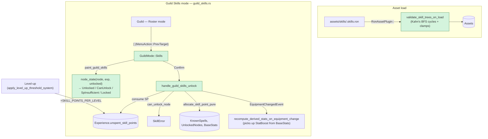

## TL;DR

Feature #20 Phase 2 ships per-class skill trees, skill-point accumulation, and a Guild Skills mode where players spend SP to unlock spells (Mage/Priest) and passives (Fighter). 25 new tests, Δ Cargo.toml = 0. **Stacked PR — base is `feature-20a-spell-registry` (PR #21), not `main`.**

## Why now

#20a (PR #21, open) shipped the spell registry + cast resolver. The `KnownSpells` component this PR populates is read by Phase 3's SpellMenu (next PR). The 4-state painter helps players plan SP spend — yellow tier ("almost affordable") vs grey ("blocked") was Cat-C-1=B.

Plan: `project/plans/20260514-120000-feature-20-spells-skill-tree.md`
Impl summary: `project/implemented/20260514-120000-feature-20b-skill-trees.md`

## How it works



## Reviewer guide

Start at **`src/data/skills.rs`** — the schema. `SkillTree { class_id, nodes }`, `SkillNode { id, cost, min_level, prerequisites, grant }`, `NodeGrant::{LearnSpell, StatBoost, Resist}`. `validate_no_cycles` uses Kahn's BFS topo-sort. `clamp_skill_tree` enforces `MAX_SKILL_TREE_NODES`, `MAX_SKILL_NODE_COST`, `MAX_SKILL_NODE_MIN_LEVEL`.

Then by file:

- **`src/plugins/party/skills.rs`** — `KnownSpells`, `UnlockedNodes`, `WarnedMissingSpells` resource (`HashSet<(SpellId, Entity)>` matches Q9 per-character semantics — note this key shape was a Cat-A fix during planning). `can_unlock_node` gates: cap → already unlocked → level → prerequisites → SP. `allocate_skill_point_pure` mutates `Experience.unspent_skill_points` first, then routes by `NodeGrant`.
- **`src/plugins/party/progression.rs`** — `SKILL_POINTS_PER_LEVEL = 1`; SP awarded in `apply_level_up_threshold_system` after the level increment. Note: `current_xp` is accumulating (#19 Q7=B), so passing 2 level thresholds in one frame correctly awards 2 SP.
- **`assets/skills/{fighter,mage,priest}.skills.ron`** — Fighter is StatBoost+Resist only (no MP); Mage and Priest mix LearnSpell + StatBoost. All `NodeGrant::LearnSpell` IDs validated by hand against `core.spells.ron`. Per Cat-C-3=A, NOT cross-checked at load — bogus IDs surface in Phase 3.
- **`src/plugins/loading/mod.rs:282-323`** — `validate_skill_trees_on_load`. Validator scope is **structural only** (cycles + unknown prerequisites + size clamps). On cycle: `error!` + empties tree. Painter then shows "(skill tree unavailable)".
- **`src/plugins/town/guild_skills.rs`** — `NodeState` 4-state enum, `node_state()` pure fn, `node_depth()` memoized DFS, painter + input handler + unlock handler. Two type aliases (`SkillsPainterPartyQuery`, `SkillsInputPartyQuery`) to satisfy clippy `type_complexity`.
- **`src/plugins/town/guild.rs`** — `GuildMode::Skills` variant; `[` (PrevTarget) enters Skills mode from Roster. `node_cursor` on `GuildState`. Cancel returns to Roster.

Skim test modules (`#[cfg(test)]` at the bottom of each file) — 25 new tests + 1 new integration test `tests/skill_tree_loads.rs`.

## DungeonAssets fixture fan-out

Adding 3 `Handle<SkillTree>` fields to `DungeonAssets` ripples through **7 test-fixture sites** (not just the 2 in `tests/`). Each in-tree `make_test_app` constructs a synthetic `DungeonAssets` because `MinimalPlugins` doesn't include the production `RonAssetPlugin` chain. All 7 sites updated:

- `tests/dungeon_movement.rs`, `tests/dungeon_geometry.rs`
- `src/plugins/dungeon/tests.rs`, `src/plugins/dungeon/features.rs`
- `src/plugins/ui/minimap.rs`
- `src/plugins/combat/encounter.rs`, `src/plugins/combat/turn_manager.rs`

This is necessary scope — without it `cargo test` won't compile. Not scope creep.

## Scope / out-of-scope

**In scope:**
- `SkillTree`/`SkillNode` schema + `NodeGrant::{LearnSpell, StatBoost, Resist}`
- `KnownSpells`, `UnlockedNodes`, `WarnedMissingSpells`
- `Experience.unspent_skill_points` + `total_skill_points_earned` (`#[serde(default)]` — backwards-compat)
- `SKILL_POINTS_PER_LEVEL = 1` (#20 Cat-C-6)
- `validate_no_cycles` (Kahn's) at load; clamps
- 3 RON asset files (fighter/mage/priest)
- `GuildMode::Skills` 4-state painter + input handler + unlock handler
- `[` keybind from Roster → Skills mode
- `EquipmentChangedEvent` write on StatBoost unlock for derived-stat recompute
- 25 new tests + 1 integration test

**Out of scope (deferred to Phase 3, PR #20c):**
- SpellMenu UI (the consumer of `KnownSpells`)
- Combat-side spell casting input (target → spell → cast flow)
- `WarnedMissingSpells` warn-once side effect (lives in the painter, not in Phase 2)
- Class-change / skill respec (locked out per #20 Cat-A — Q7)

**Out of scope (carry-forward issue #22):**
- `apply_poison_damage` + `apply_regen` still PartyMember-only. Safe today (no enemy `StatusTickEvent` emitter). Must be widened before any feature adds enemy-tick emission. Tracked: https://github.com/codeinaire/druum-dungeon-crawler/issues/22

## User decisions (locked in plan, applied verbatim)

| # | Question | Decision |
|---|---|---|
| C-1 | Painter state count | **B** — 4-state with yellow "SP-insufficient" tier |
| C-3 | Bad SpellId in NodeGrant::LearnSpell | **A** — warn-and-filter at consume-time only (painter, Phase 3) |
| Plan Q1 | Per-class trees coverage | ALL three (Fighter passives, Mage/Priest spells) |
| Plan Q6 | SP per level-up | 1 |
| Plan PR-shape | Bundling | Three separate PRs, **stacked** |

## Notable invariants for reviewer attention

- **`SkillTree.class_id` is locked** — the painter selects a tree via `DungeonAssets::skill_tree_for(class)`. Renaming a class without updating the matching RON breaks the lookup silently (returns None → "(skill tree unavailable)").
- **Discriminant order preserved on `Experience` extension.** New fields appended; `#[serde(default)]` keeps old save formats valid.
- **`PartyMemberBundle` additive only.** `KnownSpells` and `UnlockedNodes` appended; existing spawn sites compile without change.
- **`node_depth` is memoized DFS** for the visual ordering. Acyclic guaranteed by the load-time validator; the recursion can't loop in practice. Memoizes via `HashMap<NodeId, usize>`.
- **`SkillError::CapReached` returned through `AlreadyUnlocked`.** A node already in `UnlockedNodes` short-circuits before the cap check, since the cap is structurally guaranteed if `UnlockedNodes.len() <= MAX_SKILL_TREE_NODES`. The `AlreadyUnlocked` gate also subsumes the cap path.

## Risk and rollback

Low — all changes are additive and behind new `GuildMode::Skills`. Specific risks:

1. **Cycle in author-edited RON** — handled. `validate_skill_trees_on_load` logs `error!` and empties the tree. Painter shows "(skill tree unavailable)". No panic, no silent data corruption. Test `validates_and_clears_tree_with_cycle` guards.
2. **`StatusEffects` widening from #20a** — irrelevant to Phase 2. No new `ApplyStatusEvent` writers in this PR.
3. **Carry-forward #22 (poison/regen on enemies)** — not regressing; documented + tracked.

Rollback: revert this commit. No data migration; `#[serde(default)]` on new `Experience` fields means existing characters load with `unspent_skill_points: 0, total_skill_points_earned: 0`. No new Cargo dependencies.

## Future dependencies

- **#20c (Phase 3 — SpellMenu UI)**: imports `KnownSpells`, `WarnedMissingSpells`, `DungeonAssets.spells`. Will implement the warn-once side effect described in Q9. Will stack on Phase 2 (TBD with user before ship).
- **#21 (Loot Tables)**: independent. Does not interact with this PR.

## Test plan

- [x] `cargo check` (both feature variants) — exit 0
- [x] `cargo test --lib` — **363 / 363** pass (default), **367 / 367** with `--features dev`
- [x] `cargo test --test '*'` — 8 / 8 integration tests pass (including new `skill_tree_loads`)
- [x] `cargo clippy --all-targets -- -D warnings` (both feature variants) — exit 0
- [x] No new Cargo dependencies (`Cargo.toml` delta: 0)
- [x] Anti-pattern grep on new files (`derive(Event)|EventReader<|EventWriter<`, `effects.push|retain`) — zero matches

**25 new tests distributed across:**
- `src/data/skills.rs` — schema, Kahn cycle detect, clamp (8 tests)
- `src/plugins/party/skills.rs` — gates, `can_unlock_node` error precedence, allocate_skill_point_pure (8 tests)
- `src/plugins/town/guild_skills.rs` — `node_state` pure fn + 5 painter/handler integration tests (7 tests)
- `src/plugins/party/progression.rs` — extended `xp_threshold_triggers_level_up` + new `level_up_awards_skill_points_per_const` (2 tests)
- `tests/skill_tree_loads.rs` — RON load + Kahn validation through full app boot (1 integration test)

### Manual UI smoke test

```
cargo run --features dev
```

Press F9 to cycle to `GameState::Town`, then navigate to Guild.

- [x] **Roster mode header** shows `"Guild — Roster"` by default
- [x] **Press `[`** — switches to `"Guild — Skill Trees"` mode
- [x] **Pick a Fighter** — skill tree shows 6 nodes (Endurance, Toughness, Resist Sleep, etc.). All grey at L1 with no SP.
- [x] **Earn XP to level up** — SP indicator shows `1/1 unspent`
- [x] **Move cursor to a no-prereq node like `endurance`** — color is bright green (Can-unlock-now)
- [x] **Confirm** — node turns green-with-checkmark; `BaseStats.vitality` recomputes via `EquipmentChangedEvent`; SP counter drops to `0/1`
- [x] **Cursor on a 2-SP node like `fighter_might_2`** with 1 SP available — color is yellow (SP-insufficient)
- [x] **Cursor on a node whose prerequisite isn't unlocked** — color is grey (Locked); row gloss reads "(req: Endurance)"
- [x] **Pick a Mage; cursor on `learn_halito` after unlocking the prereq** — Confirm appends `halito` to `KnownSpells`. (Phase 3 will surface this in combat.)
- [x] **Press Cancel/Escape** — returns to Roster mode
- [x] **Restart** — `[` re-enters Skills mode; `UnlockedNodes` persists for the live session

🤖 Generated with [Claude Code](https://claude.com/claude-code)
